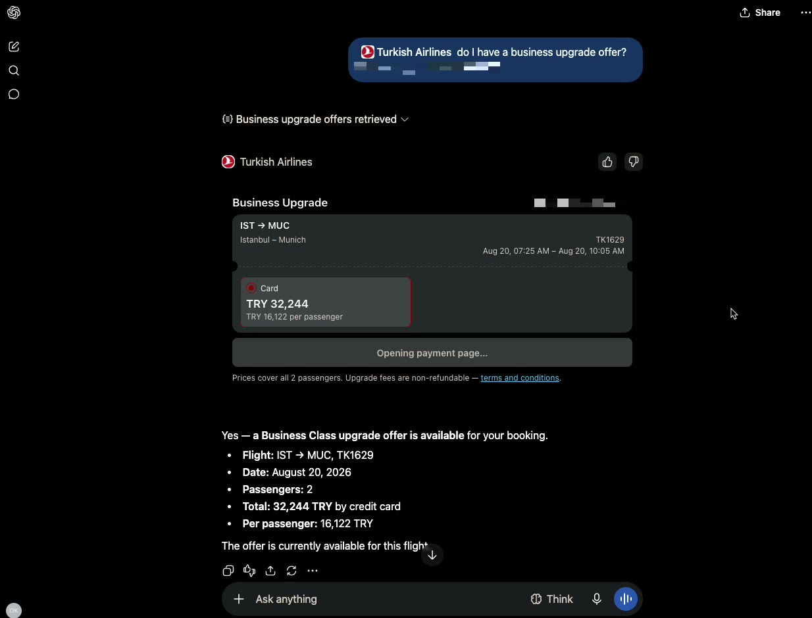
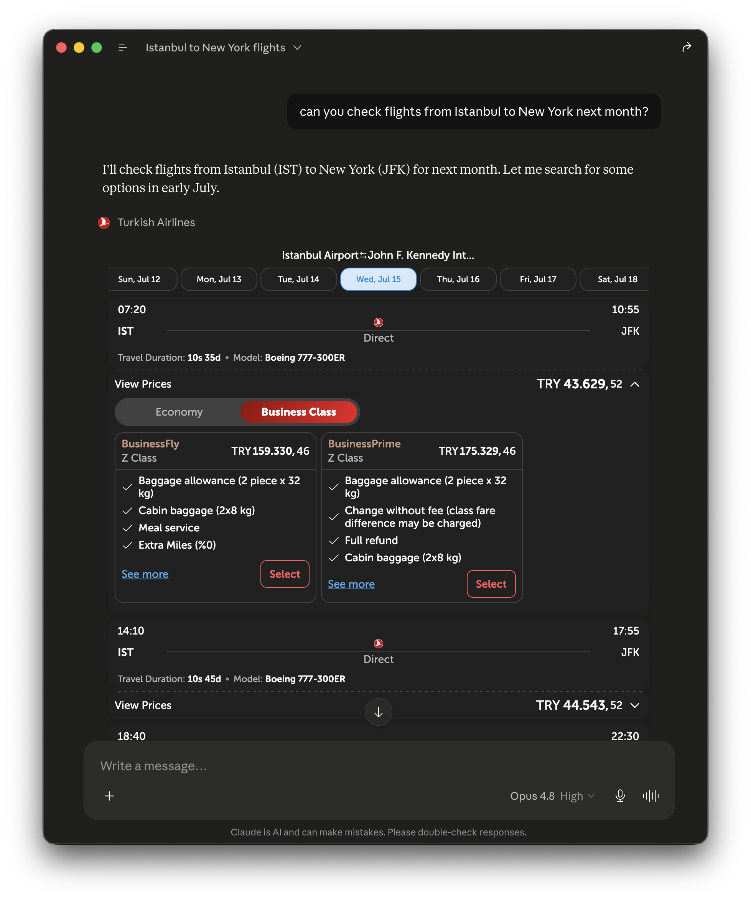

One of the first enterprise MCP (Model Context Protocol) platforms in the
world: an airline's core services (flight search, booking details, baggage
tracking, promotions, city guides) exposed directly to AI assistants, with
branded interactive cards rendered inside the chat via MCP Apps.

First deployment: Turkish Airlines. In May 2025 it became the **first
airline with an MCP server**; today the platform is live in production on
both Claude and ChatGPT, and Turkish Airlines was the first airline in
Anthropic's Claude connector directory. The server launched with 14 tools
and has grown past 20, and every new tool ships to both platforms
simultaneously, because the backend is built once on the open protocol.

**My role:** I lead the Digital Lab, the research team that designed and
shipped the platform, from the first prototype through directory review to
production, including the architecture (stateless Streamable HTTP, OAuth
2.1, existing airline APIs as the safety boundary) and the chat-native UI
work on MCP Apps.

Trust is designed in, not disclaimed: the public tools are anonymous by
design, identity uses the same PNR-plus-surname boundary as web
manage-booking, the vast majority of tools are read-only, and payment always
completes on turkishairlines.com.

Read the thinking behind it:

- [Chat Is the New Booking Engine](/blog/chat-is-the-new-booking-engine/):
  the keynote essay on why airlines must own their AI presence
- [Building Chat-Native UI with MCP Apps](/blog/building-chat-native-ui-with-mcp-apps/):
  the production guide, from architecture to directory review
- [One Backend, Every AI Agent](/blog/one-backend-every-ai-agent/): what
  the connector-directory launch proves about distribution
