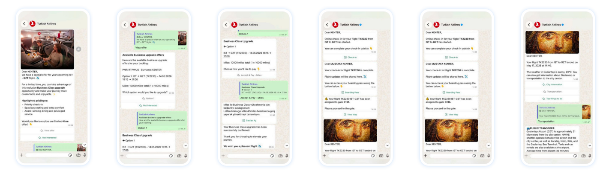
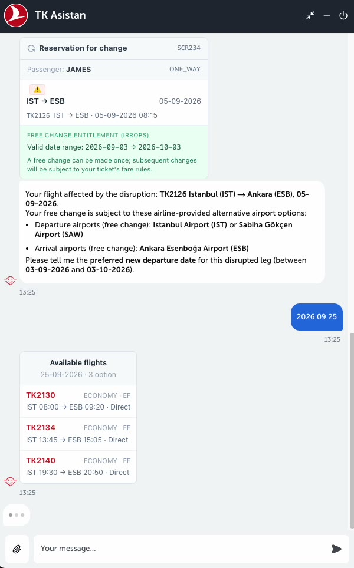
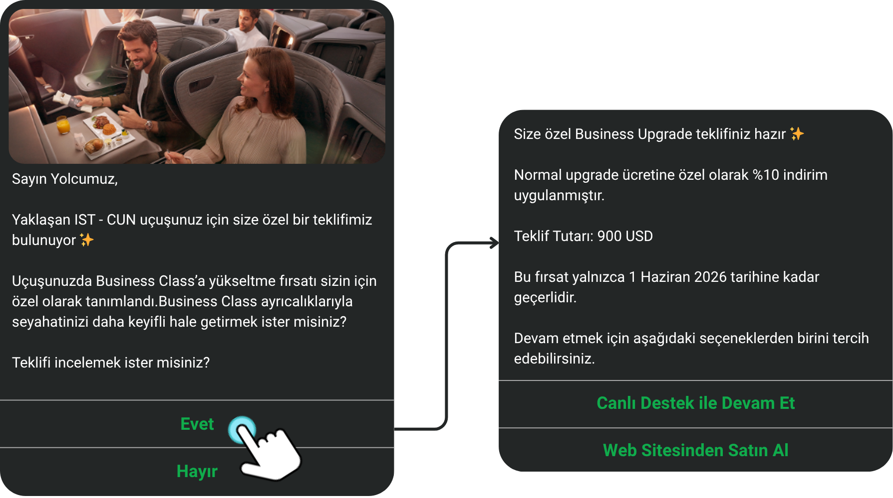

Turkish Airlines has answered passengers in chat for a decade, the thread
that started with [Boti](/projects/boti/) in 2018. TKAssistant is that
lineage reborn as an agentic platform: one channel-agnostic conversation
model behind WhatsApp, web, and in-app chat, where the AI assistant and the
human support queue live on the same system, so a handoff is a transfer,
not a dead end.

The scale is public: announcing the milestone,
[Turkish Airlines' CEO put it](https://www.linkedin.com/feed/update/urn:li:ugcPost:7497886480246136832/)
at **more than two million completed conversations since the start of
2026, in over 100 languages**: flight search, status, baggage allowance,
boarding passes, ticket changes and refunds, business upgrades, Turkish
Holidays. Say hello yourself at
[air.tk/tk-asistan](https://air.tk/tk-asistan).

The brain is an LLM with typed tools and guarded actions: a message arrives
with its context, the model picks from vetted capabilities, and anything
consequential runs on rails: a dedicated agent for disruption handling,
payment flows that always complete on turkishairlines.com, and bot changes
that ship through an evaluation exam like code through CI.

What it does in production, today:

- **Disruption management**: cancellations stream in as events; the
  assistant validates the passenger's free-change entitlement, offers
  alternatives, and completes the change or refund in the thread.

  
- **Conversational commerce**: business-upgrade offers land as a reply,
  and the thread carries through payment link to boarding pass.

  
- **Live translation**: human agents write in their language, passengers
  read in theirs.
- **One codebase, multiple brands**: the same platform also runs
  **AJet Asistan**, serving AJet's passengers from the same codebase.

TKAssistant is one half of a pair: the tool-calling protocol the platform
consumes inward is what the
[enterprise MCP platform](/projects/airline-mcp/) exposes outward, putting
the same capabilities inside Claude and ChatGPT. Both halves were the
subject of my Star Alliance AI-VEC Showcase talk (2026).
